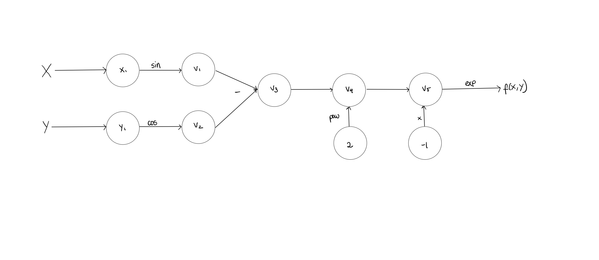
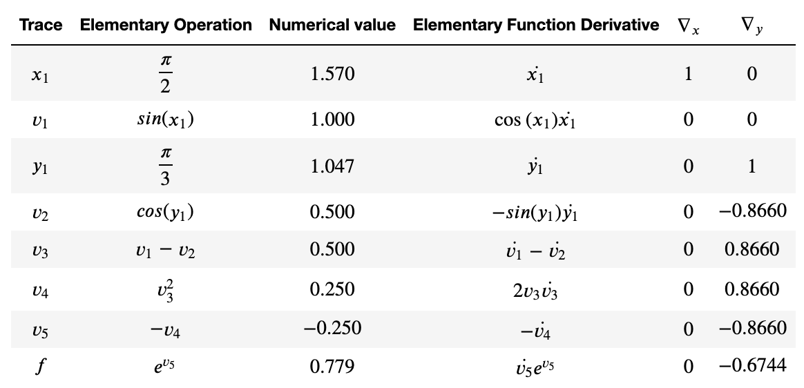

# Milestone 2

## Introduction

Automatic Differentiation, or Algorithmic Differentiation, is a term used to describe a collection of techniques that can be used to calculate the derivatives of complicated functions. Because derivatives play a key role in computational analyses, statistics, and machine and deep learning algorithms, the ability to quickly and efficiently take derivatives is a crucial one. Other methods for taking derivatives, however, including Finite Differentiation and Symbolic Differentiation have drawbacks, including extreme slowness, precision errors, inaccurate in high dimensions, and memory intensivity.  Automatic differentiation addresses many of these concerns by providing an exact, high-speed, and highly-applicable method to calculate derivatives. Its importance is evidenced by the fact that it is used as a backbone for TensorFlow, one of the most widely-used machine learning libraries. In this project, we will be implementing an Automatic Differentiation library that can be used as the basis for analysis methods, including a Newton’s Method extension that we will illustrate. 


## Background


The principal concept that is going to be leveraged through automatic differentiation is that we will construct the point derivative of every function based on how a function can be decomposed into elementary operations. Computing the derivatives of these different atoms will subsequently enable us to be able to construct derivatives of a wide range of real-valued functions. Therefore, the derivative of every function can be deduced from simple laws : how to derive basic functions (or atoms) and how to handle the derivates on basic operations of functions. THis is explained in the following table. We first present the atoms and then present how to handle the derivative on basic operations on functions. Here, x is a real variable and u and v are functions. 

|Atom function   |   Derivative |
|:--------------:|:-------------:|
|$x^r$           | r*x^{r-1}    |
|$ln(x)$|$\frac{1}{x}$|
|e^x|e^x|
|cos(x)|-sin(x)|
|sin(x)|cos(x)|
|u+v|u'+v'|
|uv|u'v+uv'|
|$\frac{u}{v}$|$\frac{u'v-uv'}{v^2}$|
_Table 1._


Now that we know how to compute the derivatives of atoms and how to handle derivatives on basic operations of functions, we want to visualize how can a function be decomposed into thse basic operations.
An important visualization of how a function can be decomposed into several elementary operations is the computational graph. 

For instance, we are going to draw the graph of the function $[f(x,y) =exp(-(sin(x)-cos(y))**2)$]



Therefore, the resulting quantity of interest can be explicitely expressed as a composition of several functions. In order to compute the derivative of these successive compositions, we are going to leverage a powerful mathematical tool: the **chain rule**.
A simple version of the chain rule can be expressed as follows : for $f$ and $g$ two functions, 

$[f(g)]' = g'*f'(g)$*

Therefore, from the computational graph we have seen above, we can express the derivative of the function encoded at every node by computing the derivative of this elementary operation and multiplyingby the derivative of the inner function. We know that we are able to compute the derivative of the elementary operation from the derivative of the different atom functions. 
Now, the question is to get the derivative of the inner function, that represents all the composition of the different operations encoded at every node until the current node. We do this iteratively, by applying at every node the chain rule with the previous composition operations. 
This suite of operations is encoded on the trace table. 




Therefore, from the previous points, we see that we will be able to compute value of the gradient of a function evaluated on a point by iteratively applying the chain rule at every operation node and leveraging a set of basic derivatives and operation on derivatives.


 


## How to use

- The url to the project is: https://github.com/cityscape-107/cs107-FinalProject


- Install Anaconda, then create and activate a virtual environment.

```
#in command line
conda -V
conda create -n Cityscape
activate Cityscape
```

- Install dependencies

```
#in command line
conda install numpy
conda install math

```

- Download Cityscape AD from https://github.com/cityscape-107/cs107-FinalProject, alternatively, you can clone the repository

- Unzip downloaded file, copy `ADbase2.py` into your current working directory

- If you are unsure of current working directory, run:
```
>>> import os

>>> os.getcwd()
```

- Then, in your script, import `ADbase2`
```
>>> from ADbase2 import *

```


- Define 1D scalar variable

```
# x=a, and is of 1 dimension
>>> x = AD(a,1)
```

- Define function

```
>>> f = f(x)
```
- Find value and 1D Jacobian (derivative)

```
# value
>>> f.val

# Jacobian
# 1D Jacobian is just derivative, so we use .der here. 
# Use .jac in nD situations
>>> f.der
```

- Demo: ℝ1→ℝ1

Consider the case of $f(x)=2 x^{3}$ at $x=4$

```
#define variable
>>> x=AD(4,1)

#define function
>>> f=2*x**3


#value
>>> f.val
128


#Jacobian
>>> f.der
96

```


## Software organization
#### 1. Modules 
Our automatic differentiation package (named `Cityscape-107`) will consist of three modules:
 - A main module (`AD`) for the basic requirements of automatic differentiation. 
 - Two additional modules (`rootfinder` and `optimization`) as extensions of the basic requirements. The first one will be used to find roots of polynomials or functions using methods like Newton's method, which make use of the derivatives of the function. The optimization method will be used to maximize or minimize a given function making use of its derivative and maybe also making use of the rootfinder method in order to find the values for which the sderivatives become zero. Both


The `AD` module has a main class called AD. It is initialized with a two arguments (value and value for the derivative) and they are stored as `self.val` and `self.der` attributes. There are several functions including the overloaded dunder methods/operations `__add__`, `__radd__`,`__mul__`, `__sub__`, `__pow__`, etc. as well as some basic functions `sin`, `cos`, `exp`, etc.


#### 2. Directory Structure 
All the modules will be found in the directory `Cityscape-107`, under subdirectories with the name of the module. There will also be a directory for `tests`, as well as `examples` and `documentation`. Additional documentation will be also provided for each individual module.

The main directory will also include files like the `.travis.yml`, `.codecov.yml`, `setup.py`, `README.md`, `LICENSE.txt` and any other necessary files.

The structure will be similar to the following example:


```python
Cityscape-107/
        cs107-FinalProject/ #directory with the modules' folders and files
                __init__.py  
                AD/ #main module
                        __init__.py
                        ADbase2.py

                rootfinder/ #extension 1
                        __init__.py
                        rootfinder.py

                optimization/ #extension 2
                        __init__.py
                        optimization.py

                docs/ #documentation
                        doc_AD_base2.txt
                        doc_rootfinder.txt
                        doc_optimization.txt

                tests/ #tests
                        __init__.py
                        test_ADbase2.py
                        tests_rootfinder.py
                        tests_optimization.py
                        ...

                examples/
                        example1.py
                        example2.py
                        example3.py
                        ...

                requirements.txt
                .travis.yml
                .codecov.yml
                setup.py
                setup.cfg
                README.md # description or the module / goal of the project
                LICENSE.txt #terms of distribution
                ...
```

#### 3. Distribution
Currently, users should download directly from our GitHub repo. However, in the final release, we will distribute our package using `PyPI`. The files  `setup.py`, `setup.cfg`, `LICENSE.txt` and `README.md` that are outside of the `Cityscape-107` package folder are necessary for PyPI to work. 

The file `setup.py` will contain important information like:
 - the `name` and `version` of the package.
 - `download_url` (GitHub url).
 - `install_requires` (list of dependencies).
 
By uploading our package to `PyPI` it will be easy to install just by simply writting:

       $ pip install Cityscape

#### 4. Testing 
We will use the continuous integration tool `Travis-CI` linked to our GitHub project to automatically test changes before integrating them into the project. This will ensure that new changes are merged only if they pass the tests and do not break our code. The tests suite is now in the file `test_ADbase2.py` and contains many tests for the AD function. This file will be moved to a directory called `tests` in the future.

Additionally, `Codecov` will provide coverage reports of the tests performed i.e. the percentage of our code that the tests actually tested. After tests are successfully run by `Travis-CI` a report is sent to `Codecov`, which will show the test coverage of the code in our project repository. 

#### 5. Packaging: How will you package your software? Will you use a framework? If so, which one and why? If not, why not?

For ease of user implementation and due to the extensive documentation available on the software, we will use the software framework PyScaffold. Using a software framework will allow for a more coherent organization of code and more straightforward user interaction with the library. Additionally, PyScaffold is a very commonly implemented framework that has been shown to be consistently effective and could be considered like a standar for Python.


## Implementation 

#### 1. Core Class

In order to implement our Forward Mode, our core class was the AD class. 
The AD class was a representation of a Node in our computational graph. It holds as attributes a value 
and a derivative, which are computed as in the trace table. 

#### 2. Core Data Structure 

For now, our data structure only supports 1D input and 1D output. We leveraged numpy arrays as data structures
for our values and derivatives because of their convenience in term of memory and time efficiency. 
This choice has a counterpart though, we will need to handle the rigidity and the immutable aspect of these data 
structures. Furthermore, in higher dimensions, gradients are arrays and Jacobians are matrices. This 
is why we wanted our code to be adapted to numpy arrays as of now. 

#### 3. Important attributes of the class

The important attributes of the AD class are value and derivative. We decided to define the default value of 
the derivative for a new instance to be 0. Therefore, a user could implement a *constant* via only specifying its value. However, 
this choice required that when defining a *variable*, the user should input a 1 value for the value of the 
derivative. 

For now, the Jacobian and the derivative are the same value so there is no Jacobian attribute or function.

#### 4. External Dependencies

We tried to keep the external dependencies at the lowest possible. There are two reasons for that:
- User Convenience (the user does not need to install 100 packages to run our code)
- Implementation convenience (every external dependency has its own syntax in a way, and we wanted to be consistent 
in our implementation regarding design)

Therefore, the only two external dependencies needed in order to run our code are: math and numpy libraries.

#### 5. Elementary functions

We defined several elementary functions in order to define the way AD variables would interact between each other.
This has been done via overloading the elementary operations: addition, substraction, multiplication, division and power functions. 
For the division operation, we needed to pay extra attention to the __rtruediv__ operation, because of the asymmetry of this operation. 
Last, the power overloading was also delicate because of forbidden cases and the derivation of a function which exponent being another function.   
We also defined the elementary functions: trig functions, exp and log. 

#### 6. Future aspects of implementation

The next steps of our work regarding our core class:
- Define other elementary functions (sigmoid function, arcsine, arctan, ..)
- Review our implementation in order for it to be compatible with higher dimensions input and higher dimensions outputs. This should be done 
also via the overloading of elementary operations, but we should be more cautious about the way we deal with division and power. 
- Implement the future features aspect of our implementation


## Future Features
#### Handling N-Dimensions
In this release, our package handles 1D-in-1D-out situations (scalar) only. In the next update, we will add R^n^-in-R^n^-out (matrix) compatibility. 
```
# define variables
>>> x=AD(1,1)
>>> y=AD(2,1)
>>> z=AD(3,1)

#define functions
>>> f = f(x)
>>> g = g(x)
>>> z = AD.combine(f,g)

#Jacobian
#Different from 1D situation, here we must use .jac
>>> z.jac
```

#### Applications to Optimization, Gradient Descent, and Machine Learning 
There are several computational applications that implemenent a type of gradient descent that could harness our automatic differentiation tool. In order to apply our AD tool to a neural network, for instance, we would need to have variables that stored the weights for the layers of the network, and our AD tool would be used as a step of the backpropogation methodology. 

Gradient Descent, overall, is an algorithm that involves a set of parameters that will minimize a loss. It's equation looks something like this: $$\theta_{t+1} = \theta_t - \alpha * \Delta_\theta* J$$

Gradient descent is the algorithm that involves updating a set of parameters to minimize a loss, and is typically in the form of 𝜃_𝑡+1=𝜃_𝑡−𝛼∇_𝜃𝐽. The gradient here is the gradient of the loss with respect to the parameters - Automatic differentiation allows us to automate the calculation of this step / these derivatives. Our file would repeatedly make use of the AD() class to calculate the derivatives! The disadvantages of automatic differentiation outweigh the advantages in this situation. 

We would also add another subdirectory in our "code" folder - our subdirectories would then be as stated in the #2. Directory Structure section above. We would have three subdirectories under our code folder: one for "AD", one for "root finding", and one for "optimization". The code in the optimization folder would include a file that imported our AD class and, as mentioned above, used it to repeatedly calculated derivates. 

#### Other Possibilities: 
Newton's Method:
In order to implement Newton's Root Finding Method for vector valued functions of vector variables, we would add anonther subdirectory in our "code" folder - our subdirectories would then be as stated in the #2. Directory Structure section above. We would have three subdirectories under our code folder: one for "AD", one for "root finding", and one for "optimization". 

Visualizing Forward and Reverse Mode
We aim to provide a visualization tool that is comparable to "Auto-eD." Our GUI will be able to take function inputs directly, and users no longer need to do tedious input by button clicking.


